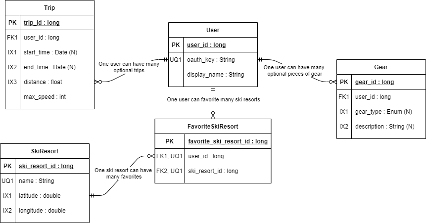

## Entity-relationship diagram

The entity-relationship diagram incorporates the following entities:

  * Trip
  
    * Shares a many optional to one mandatory relationship with User
  
  * User
    
    * Shares multiple many optional relationships with Trip, FavoriteSkiResort, and Gear
  
  * Gear
  
    * Shares a many optional to one mandatory relationship with User
  
  * SkiResort
  
    * Shares a many optional to one mandatory relationship with FavoriteSkiResort
  
  * FavoriteMountain 
  
    * Joint entity for a many to many relationship between User & SkiResort) 