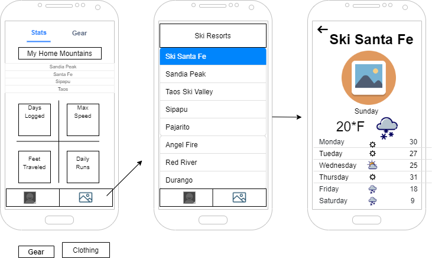

## Summary

Sno is going to be a personal ski app where users who enjoy skiing or snowboadring can customize a profile that has the mountains they ride, gear they own, rider skill level, etc. There will be a section in the app where the user can check real time stats for the mountains of their choosing. Trail maps can also be found within the mountain page.

## Intended users

* People who like to ski or snowboard

    > As someone who goes skiing often, I want to be able to see local mountain weather and log my gear to keep track of my days.

* People who are interested in the mountain stats and weather

    > As someone who can go skiing at multiple mountains, I want to be able to easily see each mountains weather forecast, base depth, and status so I can easily decide if I should go skiing that day, go to a different mountain, or just cancel for that day.

## Functionality

* Create a profile that has the users bio, riding skill level, their setup, etc.

* Select a mountain of those listed to see the mountains stats such as base depth, weather, and a trail map

## Persistent data

* User profile

* Mountain trail map if downloaded
    
## Device/external services

* <a href="https://developer.android.com/training/location">GPS</a>

* <a href="https://developer.android.com/guide/topics/sensors/sensors_overview">Accelerometer</a>

* Real Time Weather

    * <a href="https://rapidapi.com/community/api/open-weather-map">OpenWeatherMap API</a>
	
	* <a href="https://rapidapi.com/weatherbit/api/weather">Weatherbit API</a>
	
* Trail Map APIs
	
	* <a href="https://rapidapi.com/trailapi/api/trailapi">Trail API</a>

	* <a href="https://www.powderproject.com/data">Ski Trail Map API</a>

* <a href="https://cloud.google.com/maps-platform/products">Google Maps</a>

## Stretch goals/possible enhancements 

* Social media community wall where users can post and respond to each other, meet up, give tips, and talk about skiing/snowboarding.

* Friend system to add friends and sent messages through the app.

* Real time gps tracking that tracks the users vertical feet and can post their stats to a leaderboard. The real time tracking can see what trails the user has taken and compare it to the trail map.

* Have all mountain stats to every mountain in the USA, or even globally, and be able to see all necessary stats for that mountain.

* Have a section for tips and tricks--tutorials for tricks, general riding, fundamentals to improving.

## Wireframe

