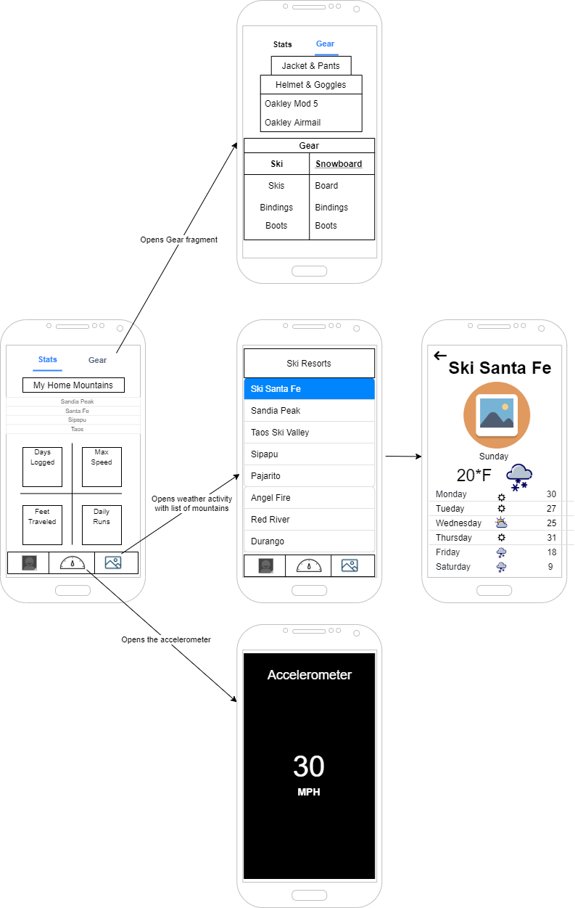

## Summary

Sno is going to be a personal ski app intended for users who enjoy skiing or snowboarding. Users of the app can customize a profile and add personal gear they own to a catalogue, track their distance traveled throughout the season, as well as logging the total days on the mountain. 
A section in the app will have a myriad of mountains across the United States that they can choose from, adding to their favorites for quick access to check the weather, trail maps, and other information regarding the mountain and its weather.

Intended Functionality:

  * Log personal gear
	
  * Track distanced traveled while riding throughout the season
	
  * Track total days ridden in a season
	
  * Display a variety of mountains that contains a link to their respective weather stats and trail maps for what is available.

## Intended users

* People who like to ski or snowboard

    > As someone who goes skiing often, I want to be able to log my gear and keep track of my distance traveled over my days throughtout the season.

* People who are interested in the mountain stats and weather

    > As someone who can go skiing at multiple mountains, I want to be able to easily see each mountains weather forecast and status so I can easily decide if I should go skiing that day, go to a different mountain, or just cancel altogether.

## Functionality

* Create a profile that has the users bio, riding skill level, their setup, etc.

* Select a mountain of those listed to see the mountains stats such as base depth, weather, and a trail map

## Persistent data

* User profile

* Mountain trail map if downloaded
    
## Device/external services

* <a href="https://developer.android.com/training/location">GPS</a>

* <a href="https://developer.android.com/guide/topics/sensors/sensors_overview">Accelerometer</a>

* Real Time Weather

    * <a href="https://rapidapi.com/community/api/open-weather-map">OpenWeatherMap API</a>
	
	* <a href="https://rapidapi.com/weatherbit/api/weather">Weatherbit API</a>
	
* Trail Map APIs
	
	* <a href="https://rapidapi.com/trailapi/api/trailapi">Trail API</a>

	* <a href="https://www.powderproject.com/data">Ski Trail Map API</a>

* <a href="https://cloud.google.com/maps-platform/products">Google Maps</a>

## Stretch goals/possible enhancements 

* Social media community wall where users can post and respond to each other, meet up, give tips, and talk about skiing/snowboarding.

* Friend system to add friends and sent messages through the app.

* Real time gps tracking that tracks the users vertical feet and can post their stats to a leaderboard. The real time tracking can see what trails the user has taken and compare it to the trail map.

* Have all mountain stats to every mountain in the USA, or even globally, and be able to see all necessary stats for that mountain.

* Have a section for tips and tricks--tutorials for tricks, general riding, fundamentals to improving.

## Wireframe

 

## Entity-relationship Diagram

(pdf/sno-erd.pdf)