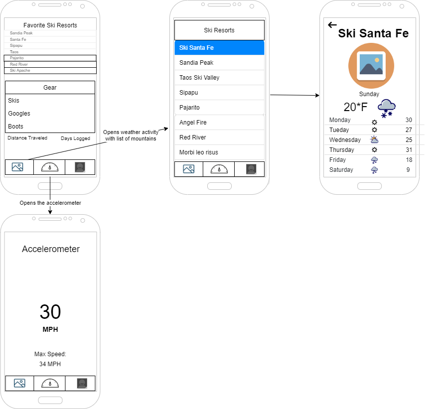

## Wireframe

The Sno wireframe will have two main screens: One for the user profile, and the second screen is for seeing 
the mountain stats and weather.

  1. The user screen will have a two sub-screens: Stats & Gear.

  2. From the list of mountains in the ski resorts screen, choosing a mountain will open another screen to show 
more detailed information regarding the chosen mountain and the weather. 